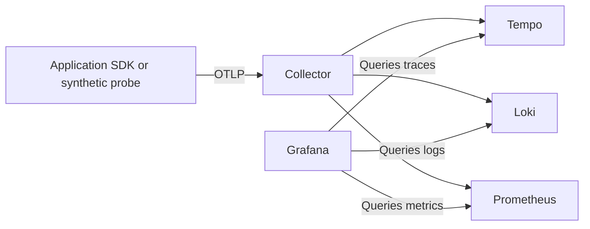

# Observability

Observability is part of the foundation in every n2f build. The local backend is
runnable today; the requirements below guide the first logger, provenance and
application instrumentation modules. They are not yet implemented application
capabilities.

## Local signal path



[Compose](compose.yaml) runs the collector and stores in `observability`, persists
its data, and starts it by default. Grafana is at `http://127.0.0.1:7340` with
local login `n2f` / `n2f_local`. The bundled Pyroscope store is also available as a
Grafana data source; profiling is not part of the current smoke example.

Suggested SDK environment for a future application running on the host:

```sh
export OTEL_SERVICE_NAME=n2f-rs
export OTEL_RESOURCE_ATTRIBUTES=service.namespace=n2f,deployment.environment.name=development
export OTEL_EXPORTER_OTLP_PROTOCOL=http/protobuf
export OTEL_EXPORTER_OTLP_ENDPOINT=http://127.0.0.1:7342
```

These variables take effect only once that application's OTel SDK is initialized.
They are deliberately separate from the Compose `N2F_*` variables. Containerized
applications use `http://observability:4318`. OTLP gRPC is also published at
`127.0.0.1:7341`. Match each SDK's protocol and endpoint convention.

## Inspect a real export

With the stack running, use Python 3 (standard library only):

```sh
python3 tools/telemetry/smoke.py --endpoint http://127.0.0.1:7342 --service n2f-rs
```

This exports a synthetic span, a log with the same trace/span IDs, and a gauge.
It uses the service name `n2f-rs-infra-smoke` so it cannot be mistaken for
application telemetry. The command prints the trace ID after collector acceptance.
An accepted export alone does not prove downstream storage succeeded.

In Grafana, open **Explore** and use:

| Data source | Query or action |
| --- | --- |
| Tempo | Search by the printed trace ID; find the `infra.smoke` span |
| Loki | `{service_name="n2f-rs-infra-smoke"}`; expand the log and follow its trace link |
| Prometheus | `n2f_infra_smoke_ratio{job="n2f/n2f-rs-infra-smoke"}` |

Allow a few seconds for batching. Use a recent time range. The smoke gauge is a
single sample, so after the instant-query lookback expires use a range query
covering the run. Its expected value is `1`. Traces and logs contain no user data.

The stored metric name includes a unit suffix; see the
[ingestion note](notes/substrate/otlp-metric-names-change-on-ingestion.md).

The example uses [OTLP JSON encoding](https://opentelemetry.io/docs/specs/otlp/).
It verifies the local signal path, not any Go, NestJS or Rust SDK integration.

## Shared application expectations

Each language should implement these meanings with its own idiomatic APIs:

- **Identity:** set `service.name`, `service.namespace`, `service.version`,
  `service.instance.id` and `deployment.environment.name` at process startup.
- **Context:** propagate trace context through inbound/outbound HTTP and background
  work. Carry event/correlation and causation IDs through persisted events. A
  request ID, event ID and trace ID have different lifetimes; do not conflate them.
- **Logs:** emit structured records with timestamp, severity, message, module,
  operation, outcome and available request/trace/span IDs. Keep credentials,
  authentication tokens, signed URL query strings and full payloads out of logs.
- **Traces:** cover transport and use-case operations, database calls, event delivery,
  mail and object requests when those adapters exist. Record expected refusal
  separately from infrastructure failure. Use short spans for WebSocket messages
  and handshake work instead of one span that stays open for the connection lifetime.
- **Metrics:** track throughput, duration and outcomes, then queue/outbox lag,
  delivery attempts and active WebSockets when implemented. Use bounded dimensions
  such as route templates, module, operation and outcome. Never use user IDs,
  trace IDs, object keys or raw request paths as metric labels.
- **Failure and lifecycle:** bound export queues, retries and shutdown flush time.
  A telemetry sink failure must not indefinitely block or turn a committed business
  operation into a reported failure. Expose export failures and dropped telemetry.
  Durable audit/provenance requirements need their own explicit contract; sampled
  traces and best-effort logs do not supply it.

Domain/application APIs must not depend on Grafana, collector or vendor SDK types.
The process root owns SDK construction and flushing. Introduce narrow owned
wrappers where actual consumers require them; do not manufacture a universal
observability interface in advance.

## Acceptance scenarios for the first implementation

1. A successful request and a refused request have useful, distinguishable outcomes
   in logs, traces and metrics, with correct service identity.
2. Concurrent requests keep their own context; async work retains its causal link.
3. A dependency failure is diagnosable without leaking credentials or payloads.
4. Stopping the collector preserves business behavior and produces an observable,
   bounded export failure; recovery resumes exporting without unbounded memory.
5. Shutdown flushes within its deadline and terminates workers/connections cleanly.
6. With events and WebSockets, replay, duplicate handling and reconnect produce
   explicit outcomes without being reported as new user actions by accident.

A health check probes components on every run; it does not rely on a stale startup
marker. Docker marking a container unhealthy is diagnostic and does not by itself
restart it. Persistence and synthetic export checks are recorded in [STATUS.md](STATUS.md).
